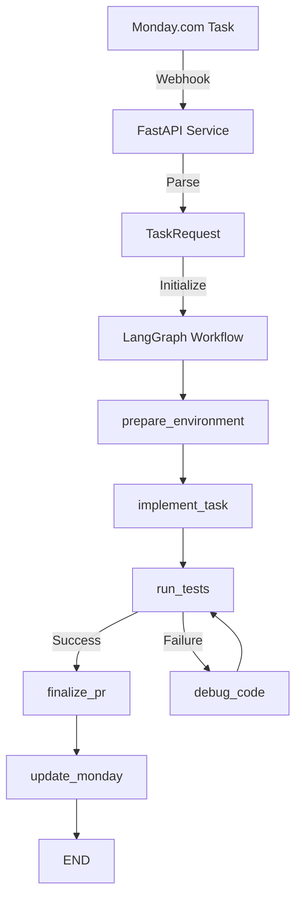

# 🤖 Agent d'Automatisation IA pour le Développement

Un système intelligent qui automatise le développement logiciel de bout en bout, depuis Monday.com jusqu'à GitHub, en utilisant LangGraph, LangChain et Claude.

## 📋 Vue d'ensemble

Ce système transforme automatiquement une tâche Monday.com en Pull Request GitHub prête pour revue, en passant par :
- ✅ Préparation de l'environnement Git
- ✅ Implémentation intelligente avec Claude
- ✅ Tests automatiques avec boucle de debug
- ✅ Création de Pull Request
- ✅ Mise à jour du statut Monday.com

## 🏗️ Architecture

### Composants Principaux

**4 Étapes du Workflow :**
1. **Déclenchement** : Webhook Monday.com → Service d'écoute
2. **Réception/Transmission** : Parsing → Lancement LangGraph  
3. **Orchestration** : Exécution des 6 nœuds avec boucles
4. **Finalisation** : GitHub PR + Monday.com update

**6 Nœuds LangGraph :**
1. `prepare_environment` - Configuration Git et dépendances
2. `implement_task` - Implémentation avec Claude
3. `run_tests` - Exécution des tests
4. `debug_code` - Correction automatique des erreurs
5. `finalize_pr` - Création Pull Request GitHub
6. `update_monday` - Mise à jour ticket Monday.com

**4 Outils/Commis Spécialisés :**
1. `ClaudeCodeTool` - Écriture et modification de code
2. `GitHubTool` - Gestion des repositories et PR
3. `MondayTool` - Interface avec Monday.com
4. `FileSystemTool` - Opérations sur les fichiers

### Flux de Données



## 📁 Structure du Projet

Le projet est organisé en trois dossiers principaux :

- **`backend/`** : Code backend (API FastAPI, services, IA, etc.)
- **`frontend/`** : Application React (interface d'administration)
- **`artifacts/`** : Scripts, migrations SQL, sauvegardes, logs

Pour plus de détails, consultez le [Guide de Migration](MIGRATION_GUIDE.md) et [README_STRUCTURE.md](README_STRUCTURE.md).

## 🚀 Installation et Configuration

### 1. Démarrage Rapide avec Docker (Recommandé)

```bash
# Cloner le repository
git clone <repo-url>
cd S6-Stage-AI-Assistant-Agent

# Créer le fichier .env à partir du template
cp artifacts/env_template.txt .env

# Éditer le fichier .env avec vos clés API
nano .env

# Démarrer tous les services
chmod +x start.sh
./start.sh
```

### 2. Développement Local (Sans Docker)

```bash
# Créer le fichier .env
cp artifacts/env_template.txt .env

# Éditer le fichier .env
nano .env

# Lancer en mode développement
chmod +x start-dev.sh
./start-dev.sh
```

### 3. Configuration des variables d'environnement

Le fichier `.env` doit être créé à la racine du projet :

**Variables requises :**
```env
# API Keys
ANTHROPIC_API_KEY=your_claude_api_key
GITHUB_TOKEN=your_github_token
MONDAY_API_KEY=your_monday_api_key

# Webhook
WEBHOOK_SECRET=your_secret_key

# Configuration Git
DEFAULT_REPO_URL=https://github.com/username/repo.git

# Monday.com
MONDAY_BOARD_ID=your_board_id
MONDAY_TASK_COLUMN_ID=task_description
MONDAY_STATUS_COLUMN_ID=status
```

### 3. Configuration Monday.com

1. **Créer les colonnes requises :**
   - `Description Technique` (Texte long)
   - `Branche Git` (Texte)
   - `Statut` (Étiquettes)
   - `Priorité` (Étiquettes)
   - `Assigné` (Personne)

2. **Configurer le webhook :**
   - Aller dans Intégrations → Webhooks
   - URL : `https://votre-domaine.com/webhook/monday`
   - Événements : "Item created"
   - Secret : Votre `WEBHOOK_SECRET`

### 4. Configuration GitHub

1. **Créer un Personal Access Token :**
   - Aller dans Settings → Developer settings → Tokens
   - Permissions requises : `repo`, `pull_requests`

2. **Configurer le repository :**
   - S'assurer que les tests sont configurés
   - Avoir un `package.json` ou `requirements.txt`

## 🏃 Utilisation

### Démarrage du service

```bash
# Option 1: Avec Docker (tous les services)
./start.sh

# Option 2: Mode développement (backend uniquement)
./start-dev.sh

# Option 3: Démarrage manuel du backend
cd backend
python main.py

# Ou avec uvicorn
cd backend
uvicorn main:app --reload --host 0.0.0.0 --port 8000
```

**Accès aux services :**
- API Backend: http://localhost:8000
- Documentation API: http://localhost:8000/docs
- RabbitMQ Management: http://localhost:15672
- Flower (Celery): http://localhost:5555

### Workflow automatique

1. **Créer une tâche dans Monday.com :**
   ```
   Titre: "Ajouter validation d'email"
   Description: "Implémenter une validation d'email côté client 
                et serveur pour le formulaire d'inscription"
   Branche: "feature/email-validation"
   Priorité: "High"
   ```

2. **L'agent s'exécute automatiquement :**
   - ✅ Clone le repo et crée la branche
   - ✅ Analyse le code existant
   - ✅ Implémente la fonctionnalité
   - ✅ Lance les tests
   - ✅ Corrige automatiquement les erreurs
   - ✅ Crée la Pull Request
   - ✅ Met à jour Monday.com

3. **Résultat :**
   - PR GitHub avec code implémenté
   - Tests passants
   - Documentation automatique
   - Ticket Monday.com mis à jour

### Utilisation manuelle

```bash
# Test des outils
curl -X POST http://localhost:8000/tools/test

# Lancement manuel d'un workflow
curl -X POST http://localhost:8000/workflow/run \
  -H "Content-Type: application/json" \
  -d '{
    "task_id": "123456789",
    "title": "Test task",
    "description": "Description détaillée",
    "git_branch": "feature/test-branch"
  }'
```

## 📖 Guide du Développeur

### Structure du Projet

```
ai-dev-automation/
├── main.py                 # Point d'entrée FastAPI
├── requirements.txt        # Dépendances Python
├── config/
│   └── settings.py         # Configuration centralisée
├── models/
│   ├── state.py           # État LangGraph
│   └── schemas.py         # Modèles Pydantic
├── tools/
│   ├── base_tool.py       # Classe de base
│   ├── claude_code_tool.py # Outil Claude
│   ├── github_tool.py     # Outil GitHub
│   └── monday_tool.py     # Outil Monday
├── nodes/
│   ├── prepare_node.py    # Préparation environnement
│   ├── implement_node.py  # Implémentation
│   ├── test_node.py       # Tests
│   ├── debug_node.py      # Debug
│   ├── finalize_node.py   # Finalisation
│   └── update_node.py     # Mise à jour Monday
├── graph/
│   └── workflow_graph.py  # Graphe LangGraph
├── services/
│   └── webhook_service.py # Service webhook
└── utils/
    ├── logger.py          # Logging structuré
    └── helpers.py         # Utilitaires
```

### Ajout de Nouveaux Outils

1. **Créer un nouvel outil :**

```python
from tools.base_tool import BaseTool

class MonNouvelOutil(BaseTool):
    name = "mon_outil"
    description = "Description de l'outil"
    
    async def _arun(self, action: str, **kwargs):
        # Implémentation
        pass
```

2. **L'intégrer dans un nœud :**

```python
from tools.mon_nouvel_outil import MonNouvelOutil

async def mon_noeud(state: GraphState) -> GraphState:
    outil = MonNouvelOutil()
    result = await outil._arun("action", param="value")
    # Traiter le résultat
    return state
```

### Personnalisation des Prompts

Les prompts Claude sont dans les nœuds `implement_node.py` et `debug_node.py`. Vous pouvez les modifier pour :
- Adapter le style de code
- Ajouter des contraintes spécifiques
- Modifier les patterns de debug

### Ajout de Nouveaux Types de Tests

Dans `test_node.py`, ajouter des détecteurs pour nouveaux frameworks :

```python
# Dans _detect_test_commands()
if "mon_framework" in all_content:
    test_commands.append("mon-framework test")
```

## 🔧 API Reference

### Endpoints Principaux

- `POST /webhook/monday` - Réception webhooks Monday.com
- `POST /workflow/run` - Lancement manuel workflow
- `GET /workflow/status/{task_id}` - Statut workflow
- `GET /health` - Santé du système
- `POST /tools/test` - Test des outils

### Modèles de Données

**TaskRequest :**
```python
{
    "task_id": "string",
    "title": "string", 
    "description": "string",
    "git_branch": "string",
    "repository_url": "string?",
    "priority": "string?",
    "assignee": "string?"
}
```

**Workflow Result :**
```python
{
    "success": bool,
    "status": "completed|failed",
    "pr_url": "string?",
    "metrics": {
        "files_modified": int,
        "tests_executed": int,
        "debug_attempts": int
    }
}
```

## 🔍 Monitoring et Debugging

### Logs Structurés

Le système utilise `structlog` avec des logs colorés :

```python
from utils.logger import get_logger
logger = get_logger(__name__)

logger.info("Message", task_id="123", success=True)
```

### Métriques Importantes

- **Durée des workflows**
- **Taux de succès des tests**
- **Nombre de tentatives de debug**
- **Fichiers modifiés par tâche**

### Debug des Workflows

1. **Vérifier les logs :**
   ```bash
   # Logs en temps réel
   tail -f logs/ai-agent.log
   ```

2. **Tester manuellement un nœud :**
   ```python
   from nodes.implement_node import implement_task
   from models.state import GraphState
   
   # Créer un état de test
   state = {...}
   result = await implement_task(state)
   ```

3. **Analyser l'état LangGraph :**
   - Checkpoints automatiques
   - Historique des transitions
   - État à chaque étape

## 🚀 Déploiement

### Docker

```dockerfile
FROM python:3.11-slim

WORKDIR /app
COPY requirements.txt .
RUN pip install -r requirements.txt

COPY . .
EXPOSE 8000

CMD ["uvicorn", "main:app", "--host", "0.0.0.0", "--port", "8000"]
```

### Variables d'Environnement Production

```env
DEBUG=false
LOG_LEVEL=INFO
TASK_TIMEOUT=1800
TEST_TIMEOUT=300
```

### Considérations de Sécurité

- ✅ Validation des signatures webhook
- ✅ Sanitisation des noms de branches
- ✅ Limitation des timeouts
- ✅ Gestion sécurisée des secrets
- ✅ Isolation des environnements de travail

## 🤝 Contribution

1. Fork le repository
2. Créer une branche feature
3. Implémenter et tester
4. Créer une Pull Request

### Standards de Code

- ✅ Type hints Python
- ✅ Docstrings détaillées
- ✅ Tests unitaires
- ✅ Logging structuré
- ✅ Gestion d'erreurs robuste

## 📊 Métriques et Performance

### Temps d'Exécution Typiques

- **Préparation environnement** : 30-60s
- **Implémentation simple** : 2-5 min
- **Tests et debug** : 1-3 min
- **Finalisation** : 30s
- **Total** : 4-9 minutes

### Taux de Succès

- **Tâches simples** : 85-95%
- **Tâches complexes** : 70-80%
- **Avec debug** : +15% de succès

## 🔗 Intégrations

### Monday.com
- Webhooks entrants
- GraphQL API
- Gestion des colonnes personnalisées

### GitHub
- REST API v4
- Gestion des branches
- Pull Requests automatiques

### Claude (Anthropic)
- Claude-3 Sonnet
- Prompts contextuels
- Génération de code

## 📝 Licence

MIT License - Voir le fichier LICENSE pour plus de détails.

## 🆘 Support

Pour toute question ou problème :
1. Vérifier les logs applicatifs
2. Consulter la documentation API
3. Créer une issue GitHub
4. Contacter l'équipe de développement

---

**Version** : 1.0.0  
**Dernière mise à jour** : Janvier 2024 